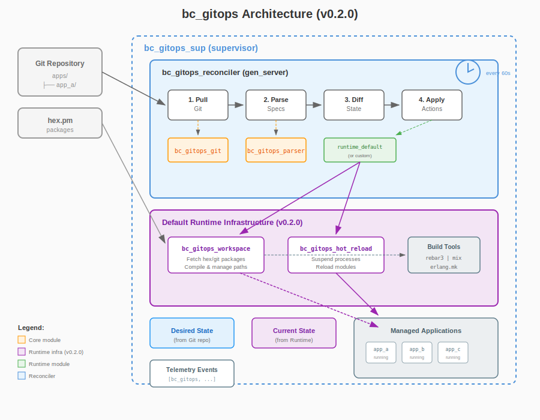
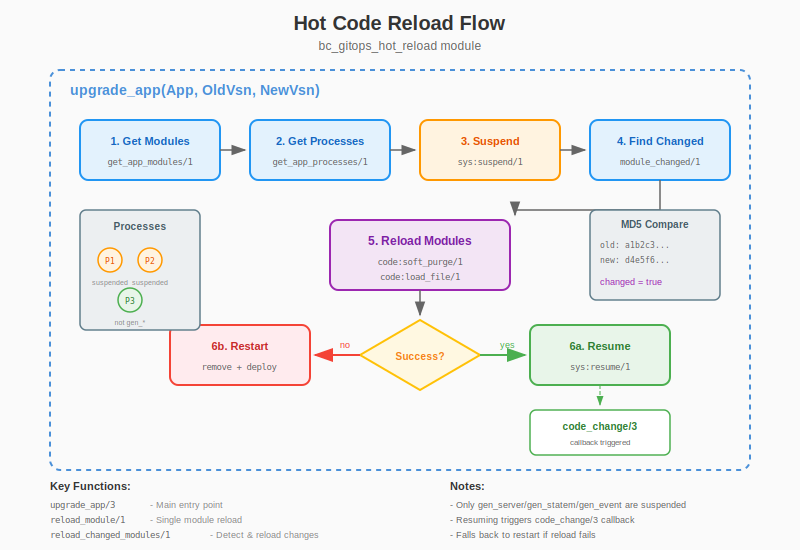

# bc_gitops

[](https://hex.pm/packages/bc_gitops)
[](https://hexdocs.pm/bc_gitops)
[](LICENSE)
[](https://buymeacoffee.com/beamologist)

**BEAM-native GitOps reconciler for OTP applications.**

bc_gitops brings the GitOps pattern to the BEAM ecosystem. It monitors a Git repository for application specifications and automatically reconciles the running system to match the desired state—deploying new applications, upgrading versions, and removing deprecated ones.

## Why bc_gitops?

Traditional GitOps tools like Flux and ArgoCD are built for Kubernetes. But what if you're running a BEAM cluster without Kubernetes? Or you want tighter integration with OTP's powerful release and hot code upgrade capabilities?

bc_gitops provides:

- **Works out of the box** - Default runtime fetches packages from hex.pm and git, compiles, and starts them
- **Native BEAM integration** - Works directly with OTP applications, releases, and supervision trees
- **Hot code upgrades** - Automatic module reloading with process suspension/resumption
- **Erlang & Elixir support** - Fetches and compiles both Erlang (rebar3) and Elixir (mix) packages
- **Flexible runtimes** - Pluggable backend for custom deployment strategies
- **Observable** - Built-in telemetry events for monitoring and alerting
- **Minimal dependencies** - Only requires `telemetry`, no external services needed

## Installation

Add `bc_gitops` to your list of dependencies in `rebar.config`:

```erlang
{deps, [
    {bc_gitops, "0.2.0"}
]}.
```

Or for Elixir projects in `mix.exs`:

```elixir
def deps do
  [
    {:bc_gitops, "~> 0.2.0"}
  ]
end
```

## Quick Start

### 1. Create a GitOps Repository

Create a git repository with your application specifications:

```
my-gitops-repo/
├── apps/
│   ├── my_web_app/
│   │   └── app.config
│   └── my_worker/
│       └── app.config
└── README.md
```

Each application has a configuration file:

```erlang
%% apps/my_web_app/app.config
#{
    name => my_web_app,
    version => <<"1.0.0">>,
    source => #{
        type => hex
    },
    env => #{
        port => 8080,
        pool_size => 10
    },
    health => #{
        type => http,
        port => 8080,
        path => <<"/health">>
    },
    depends_on => []
}.
```

### 2. Configure bc_gitops

Add configuration to your `sys.config`:

```erlang
{bc_gitops, [
    {repo_url, "https://github.com/myorg/my-gitops-repo.git"},
    {branch, "main"},
    {reconcile_interval, 60000},  %% 1 minute
    {runtime_module, my_app_runtime}
]}
```

### 3. Start the Application

The default runtime (`bc_gitops_runtime_default`) handles everything:
- Fetches packages from hex.pm using rebar3 (Erlang) or mix (Elixir)
- Clones and compiles git repositories
- Performs hot code reloading during upgrades
- Manages code paths automatically

```erlang
application:start(bc_gitops).
```

bc_gitops will:
1. Clone/pull the repository
2. Parse application specifications
3. Compare desired state with current state
4. Deploy, upgrade, or remove applications as needed
5. Repeat on the configured interval

## Configuration Options

| Option | Type | Default | Description |
|--------|------|---------|-------------|
| `repo_url` | string | *required* | Git repository URL |
| `local_path` | string | `/var/lib/bc_gitops` | Local clone path |
| `branch` | string | `"main"` | Git branch to track |
| `apps_dir` | string | `"apps"` | Directory containing app specs |
| `reconcile_interval` | integer | `60000` | Reconcile interval (ms) |
| `runtime_module` | atom | `bc_gitops_runtime_default` | Runtime implementation |

## Application Specification Format

### Erlang Format (`.config`)

```erlang
#{
    name => my_app,
    version => <<"1.2.3">>,
    source => #{
        type => hex,          %% hex | git | release
        url => <<"...">>,     %% For git/release
        ref => <<"main">>,    %% For git (branch/tag/commit)
        sha256 => <<"...">>   %% For release (integrity check)
    },
    env => #{
        key => value
    },
    depends_on => [other_app],
    health => #{
        type => http,         %% http | tcp | custom
        port => 8080,
        path => <<"/health">>,
        interval => 30000,
        timeout => 5000
    }
}.
```

### JSON Format (`.json`)

```json
{
    "name": "my_app",
    "version": "1.2.3",
    "source": {
        "type": "hex"
    },
    "env": {
        "key": "value"
    },
    "depends_on": [],
    "health": {
        "type": "http",
        "port": 8080,
        "path": "/health"
    }
}
```

## API

### Manual Operations

```erlang
%% Trigger immediate reconciliation
bc_gitops:reconcile().
bc_gitops:sync().  %% alias

%% Get status
{ok, Status} = bc_gitops:status().
%% #{status => synced, last_commit => <<"abc123">>, app_count => 5, healthy_count => 5}

%% Get state
{ok, DesiredState} = bc_gitops:get_desired_state().
{ok, CurrentState} = bc_gitops:get_current_state().

%% Check specific app
{ok, AppState} = bc_gitops:get_app_status(my_app).
```

### Manual Deployment

```erlang
%% Deploy manually (bypasses git)
AppSpec = #app_spec{name = my_app, version = <<"1.0.0">>, ...},
bc_gitops:deploy(AppSpec).

%% Remove an app
bc_gitops:remove(my_app).

%% Upgrade to specific version
bc_gitops:upgrade(my_app, <<"2.0.0">>).
```

### Programmatic Start

```erlang
%% Start reconciler with custom config
bc_gitops:start_reconciler(#{
    repo_url => <<"https://github.com/myorg/gitops.git">>,
    runtime_module => my_runtime
}).

%% Stop reconciler
bc_gitops:stop_reconciler().
```

## Telemetry Events

bc_gitops emits the following telemetry events:

| Event | Measurements | Metadata |
|-------|--------------|----------|
| `[bc_gitops, reconcile, start]` | - | - |
| `[bc_gitops, reconcile, stop]` | `duration` | `status` |
| `[bc_gitops, reconcile, error]` | `duration` | `error` |
| `[bc_gitops, deploy, start]` | - | `app` |
| `[bc_gitops, deploy, stop]` | - | `app`, `result` |
| `[bc_gitops, upgrade, start]` | - | `app`, `from_version`, `to_version` |
| `[bc_gitops, upgrade, stop]` | - | `app`, `result` |
| `[bc_gitops, git, pull]` | - | `repo`, `branch` |

Example handler:

```erlang
telemetry:attach(
    <<"gitops-logger">>,
    [bc_gitops, reconcile, stop],
    fun(_Event, Measurements, Metadata, _Config) ->
        logger:info("Reconcile completed in ~p ms: ~p",
                    [Measurements, Metadata])
    end,
    []
).
```

## Default Runtime Features

The default runtime (`bc_gitops_runtime_default`) is fully functional out of the box:

### Package Fetching
- **Hex packages**: Automatically fetched via rebar3 or mix
- **Git repositories**: Cloned, compiled, and loaded
- **Code path management**: Adds compiled ebin directories to the VM

### Hot Code Reloading
During upgrades, bc_gitops:
1. Suspends processes using `sys:suspend/1`
2. Reloads changed modules with `code:soft_purge/1` + `code:load_file/1`
3. Resumes processes (triggering `code_change/3` callbacks)
4. Falls back to restart if hot reload fails

### Supported Project Types
- **rebar3** - Erlang projects with `rebar.config`
- **mix** - Elixir projects with `mix.exs`
- **erlang.mk** - Projects using Makefile

## Implementing Custom Runtimes

For production deployments with specific requirements, implement the `bc_gitops_runtime` behaviour:

```erlang
-module(my_app_runtime).
-behaviour(bc_gitops_runtime).

-export([deploy/1, remove/1, upgrade/2, reconfigure/1, get_current_state/0]).

deploy(AppSpec) ->
    %% Download from private artifact repository
    %% Integrate with service discovery
    %% Handle secrets injection
    {ok, AppState}.

remove(AppName) ->
    %% Deregister from service discovery
    %% Clean up resources
    ok.

upgrade(AppSpec, OldVersion) ->
    %% Use release_handler for OTP releases
    %% Or custom upgrade logic
    {ok, AppState}.

reconfigure(AppSpec) ->
    %% Hot config reload
    {ok, AppState}.

get_current_state() ->
    %% Return current state of all managed apps
    {ok, #{}}.
```

See the [Runtime Guide](https://hexdocs.pm/bc_gitops/runtime.html) for detailed examples.

## Git Authentication

bc_gitops uses the system `git` command, so authentication works through standard git mechanisms:

- **SSH keys**: Add your deploy key to `~/.ssh/` or use ssh-agent
- **HTTPS**: Use git credential helpers or embed credentials in URL (not recommended)
- **GitHub Actions**: Use `$GITHUB_TOKEN` with credential helper

For private repositories, we recommend SSH deploy keys with read-only access.

## Architecture



### Hot Code Reload Flow

During upgrades, bc_gitops can perform hot code reloading:



The reconciler follows a continuous loop:

1. **Pull** - Fetch latest changes from git repository
2. **Parse** - Read application specifications from `apps/` directory
3. **Diff** - Compare desired state (git) with current state (runtime)
4. **Apply** - Execute actions: deploy, upgrade, remove, or reconfigure

## Contributing

Contributions are welcome! Please read our [Contributing Guide](CONTRIBUTING.md) before submitting a PR.

## License

MIT License - see [LICENSE](LICENSE) for details.

## Acknowledgments

- Inspired by [Flux](https://fluxcd.io/) and [ArgoCD](https://argoproj.github.io/cd/)
- Built on the rock-solid foundation of OTP
- Thanks to the BEAM community for their continuous inspiration
