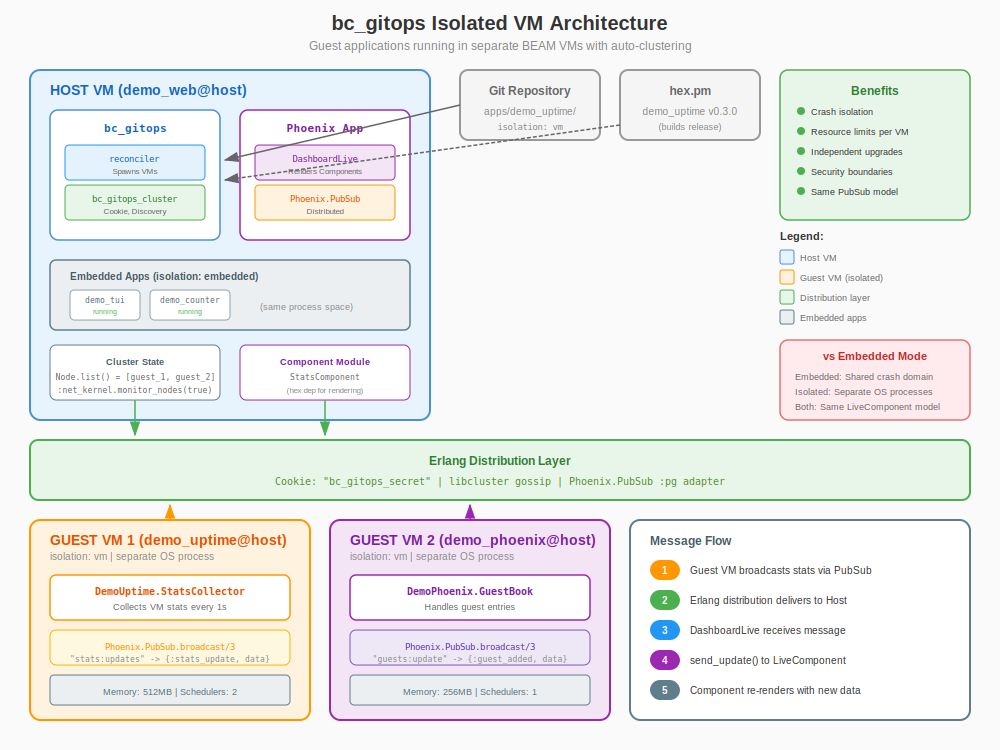

# Isolated VM Deployment Guide

bc_gitops supports running guest applications in separate BEAM VMs that auto-cluster with the host. This provides crash isolation, resource limits, and security boundaries while maintaining the same Phoenix.PubSub integration model.



## Overview

### Deployment Modes

| Mode | Configuration | Use Case |
|------|---------------|----------|
| **Embedded** (default) | `isolation => embedded` | Development, trusted apps, low overhead |
| **Isolated VM** | `isolation => vm` | Production, untrusted apps, resource isolation |

### Key Differences

| Aspect | Embedded | Isolated VM |
|--------|----------|-------------|
| Process space | Shared with host | Separate OS process |
| Crash domain | Shared (guest crash can affect host) | Isolated (guest crash doesn't affect host) |
| Memory/CPU | Shared resources | Configurable limits per VM |
| LiveComponent | Direct module call | Same (module must be available on host) |
| PubSub | Local | Distributed (automatic via Erlang distribution) |
| Startup time | Fast | Slower (spawns new BEAM VM) |

## Configuration

### Basic Isolated VM

```erlang
%% apps/my_service/app.config
#{
    name => my_service,
    version => <<"1.0.0">>,
    source => #{type => hex},

    %% Enable VM isolation
    isolation => vm,

    env => #{
        http_port => 8085
    },
    health => #{
        type => http,
        port => 8085,
        path => <<"/health">>
    }
}.
```

### With Resource Limits

```erlang
#{
    name => my_service,
    version => <<"1.0.0">>,
    source => #{type => hex},
    isolation => vm,

    %% VM-specific configuration
    vm_config => #{
        memory_limit => 512,      %% 512 MB max heap
        scheduler_limit => 2,     %% 2 schedulers (CPUs)
        node_prefix => <<"guest_">>  %% Node name: guest_my_service@hostname
    },

    env => #{
        http_port => 8085
    }
}.
```

### vm_config Options

| Option | Type | Default | Description |
|--------|------|---------|-------------|
| `memory_limit` | integer | unlimited | Max memory in MB (sets `+MMmcs`) |
| `scheduler_limit` | integer | host CPUs | Number of schedulers (sets `+S`) |
| `node_prefix` | binary | `<<"">>` | Prefix for node name |
| `extra_args` | list | `[]` | Additional erl/elixir CLI args |

## How It Works

### 1. Deployment Flow

```
┌─────────────────────────────────────────────────────────────────┐
│                     bc_gitops Reconciler                        │
└─────────────────────────────────────────────────────────────────┘
                              │
                              ▼
              ┌───────────────────────────────┐
              │  Parse app.config             │
              │  isolation => vm              │
              └───────────────────────────────┘
                              │
                              ▼
              ┌───────────────────────────────┐
              │  Fetch source (hex/git)       │
              │  Build OTP release            │
              └───────────────────────────────┘
                              │
                              ▼
              ┌───────────────────────────────┐
              │  Generate node name           │
              │  my_service@hostname          │
              └───────────────────────────────┘
                              │
                              ▼
              ┌───────────────────────────────┐
              │  Spawn BEAM VM as OS process  │
              │  with shared cookie           │
              └───────────────────────────────┘
                              │
                              ▼
              ┌───────────────────────────────┐
              │  Wait for node to join        │
              │  cluster (Node.list())        │
              └───────────────────────────────┘
                              │
                              ▼
              ┌───────────────────────────────┐
              │  Verify app is running        │
              │  via :rpc.call()              │
              └───────────────────────────────┘
```

### 2. Clustering

bc_gitops automatically configures Erlang distribution:

1. **Cookie Management**: All nodes share the same Erlang cookie
2. **Node Discovery**: Uses short names (`sname`) for local clusters
3. **Auto-Connect**: Guest VMs automatically connect to host on startup

```erlang
%% Host VM
node().          %% => demo_web@hostname

%% After guest VM starts
Node.list().     %% => [my_service@hostname]
```

### 3. Macula Platform Integration

When bc_gitops runs on the [Macula platform](https://github.com/macula-io/macula), it automatically delegates cluster infrastructure to Macula.

**How it works:**

1. bc_gitops checks if `macula` module is loaded at runtime
2. If Macula is available, clustering functions delegate to `macula:*`
3. If Macula is not available, bc_gitops uses its own implementation

```erlang
%% bc_gitops_cluster.erl - automatic delegation
ensure_distributed() ->
    case macula_exports(ensure_distributed, 0) of
        true ->
            %% Macula owns cluster infrastructure
            apply(macula, ensure_distributed, []);
        false ->
            %% Standalone mode
            do_ensure_distributed()
    end.
```

**Delegated functions:**

| bc_gitops_cluster | macula (when available) |
|-------------------|-------------------------|
| `ensure_distributed/0` | `macula:ensure_distributed/0` |
| `get_cookie/0` | `macula:get_cookie/0` |
| `set_cookie/1` | `macula:set_cookie/1` |
| `monitor_nodes/0` | `macula:monitor_nodes/0` |
| `unmonitor_nodes/0` | `macula:unmonitor_nodes/0` |

**Benefits of Macula integration:**

- **Single source of truth** for cluster configuration
- **Consistent cookie resolution** across all Macula applications
- **Centralized node monitoring** and event handling
- **bc_gitops remains standalone** when Macula is not present

See the [Macula Cluster API Guide](https://hexdocs.pm/macula/cluster_api.html) for more details.

### 4. PubSub Integration

Phoenix.PubSub works automatically across clustered nodes:

```elixir
# Guest VM: broadcast stats
Phoenix.PubSub.broadcast(MyService.PubSub, "stats:updates", {:stats_update, data})

# Host VM: receives the message automatically
# (as long as it's subscribed to the same topic)
```

**Important**: The host must be subscribed to the same PubSub name and topic. For hex packages, add the guest app as a dependency to the host to access its PubSub module.

## LiveComponent Integration

### The Key Insight

LiveComponents render in the **host's** LiveView process. For isolated VMs:

1. The **guest VM** handles business logic and broadcasts data via PubSub
2. The **host VM** receives data and renders the LiveComponent
3. The **component module** must be available on the host (add as hex dependency)

### Example Setup

**Guest app (demo_uptime)**: Broadcasts stats

```elixir
# lib/demo_uptime/stats_collector.ex
defmodule DemoUptime.StatsCollector do
  use GenServer

  @impl true
  def handle_info(:tick, state) do
    stats = DemoUptime.Stats.all()

    # Broadcast to ALL nodes in cluster
    Phoenix.PubSub.broadcast(DemoUptime.PubSub, "stats:updates", {:stats_update, stats})

    {:noreply, state}
  end
end
```

**Host app (demo_web)**: Subscribes and forwards to component

```elixir
# lib/demo_web_web/live/dashboard_live.ex
defmodule DemoWebWeb.DashboardLive do
  use Phoenix.LiveView

  def mount(_params, _session, socket) do
    if connected?(socket) do
      # Subscribe to guest app's PubSub (works across nodes!)
      Phoenix.PubSub.subscribe(DemoUptime.PubSub, "stats:updates")
    end
    {:ok, socket}
  end

  def handle_info({:stats_update, stats}, socket) do
    # Forward to the LiveComponent
    send_update(DemoUptimeWeb.StatsComponent, id: :vm_stats, stats: stats)
    {:noreply, socket}
  end

  def render(assigns) do
    ~H"""
    <.live_component
      module={DemoUptimeWeb.StatsComponent}
      id={:vm_stats}
      host_app="demo_web"
    />
    """
  end
end
```

**Host's mix.exs**: Add guest app as dependency for component module

```elixir
defp deps do
  [
    # Add guest app to get access to its LiveComponent module
    {:demo_uptime, "~> 0.3.0"}
  ]
end
```

### app.config Component Metadata

Guest apps expose PubSub metadata in their app.config:

```erlang
#{
    name => demo_uptime,
    version => <<"0.3.0">>,
    source => #{type => hex},
    isolation => vm,
    env => #{
        http_port => 8083,
        liveview_components => [
            #{
                id => vm_stats,
                module => 'Elixir.DemoUptimeWeb.StatsComponent',
                title => <<"BEAM Stats">>,
                description => <<"Real-time BEAM VM statistics">>,

                %% PubSub integration metadata
                pubsub => 'Elixir.DemoUptime.PubSub',
                topic => <<"stats:updates">>,
                update_assign => stats
            }
        ]
    }
}.
```

The host dashboard can use this metadata to automatically subscribe and forward messages.

## Operator Guide

### Starting bc_gitops with Isolated VM Support

```erlang
%% In sys.config
{bc_gitops, [
    {repo_url, <<"https://github.com/org/gitops-repo.git">>},
    {branch, <<"main">>},
    {apps_dir, <<"apps">>},

    %% Cluster configuration for isolated VMs
    {cookie, <<"your_secret_cookie_here">>},
    {node_prefix, <<"bc_gitops_">>}
]}
```

### Monitoring Isolated VMs

```erlang
%% List connected guest nodes
Node.list().

%% Check if specific guest is connected
:net_adm.ping(:"demo_uptime@hostname").

%% Get app status on remote node
:rpc.call(:"demo_uptime@hostname", :application, :which_applications, []).
```

### Health Checks

bc_gitops performs health checks on isolated VMs:

1. **Node connectivity**: `net_adm:ping/1`
2. **Application status**: `rpc:call(Node, application, which_applications, [])`
3. **HTTP health** (if configured): `httpc:request/4` to health endpoint

### Graceful Shutdown

When removing an isolated VM app:

```erlang
%% bc_gitops calls:
:rpc.call(GuestNode, :init, :stop, [])

%% Then waits for nodedown event
%% Finally cleans up state
```

### Troubleshooting

#### Guest VM Won't Connect

1. **Check cookie**: Both nodes must have the same Erlang cookie
   ```erlang
   :erlang.get_cookie().
   ```

2. **Check node names**: Must be resolvable
   ```erlang
   node().  %% Should return name@hostname
   ```

3. **Check EPMD**: Erlang Port Mapper Daemon must be running
   ```bash
   epmd -names
   ```

#### PubSub Messages Not Reaching Host

1. **Verify subscription**: Host must subscribe to the correct PubSub and topic
2. **Check PubSub adapter**: Must use `:pg` adapter (default) for distribution
3. **Verify nodes are connected**: `Node.list()` should show guest node

#### LiveComponent Not Rendering

1. **Module availability**: The component module must be on the host's code path
2. **Add as dependency**: Include guest app in host's `mix.exs` deps
3. **Check module loading**: `Code.ensure_loaded?(DemoUptimeWeb.StatsComponent)`

## Security Considerations

### Process Isolation

Isolated VMs run as separate OS processes:

- **Memory isolation**: Guest can't access host's memory
- **Crash isolation**: Guest crash doesn't bring down host
- **Resource limits**: Guest can't consume unlimited resources

### Erlang Cookie

The shared Erlang cookie is a security boundary:

- **Never commit cookies to git**
- **Use environment variables**: `RELEASE_COOKIE`
- **Rotate periodically** in production

### Network Isolation

For additional security:

1. **Separate network namespaces**: Run guests in Docker containers
2. **Firewall rules**: Restrict EPMD and distribution ports
3. **TLS for distribution**: Enable Erlang distribution over TLS

## Example: Full Configuration

### Git Repository Structure

```
gitops-repo/
├── apps/
│   ├── demo_uptime/
│   │   └── app.config      # isolation => vm
│   ├── demo_counter/
│   │   └── app.config      # isolation => embedded (default)
│   └── demo_phoenix/
│       └── app.config      # isolation => vm
```

### demo_uptime/app.config

```erlang
%% Isolated VM with resource limits
#{
    name => demo_uptime,
    version => <<"0.3.0">>,
    source => #{type => hex},
    isolation => vm,
    vm_config => #{
        memory_limit => 512,
        scheduler_limit => 2
    },
    env => #{
        http_port => 8083,
        liveview_components => [
            #{
                id => vm_stats,
                module => 'Elixir.DemoUptimeWeb.StatsComponent',
                title => <<"BEAM Stats">>,
                description => <<"Real-time BEAM VM statistics dashboard">>,
                pubsub => 'Elixir.DemoUptime.PubSub',
                topic => <<"stats:updates">>,
                update_assign => stats
            }
        ]
    },
    health => #{
        type => http,
        port => 8083,
        path => <<"/health">>
    },
    depends_on => []
}.
```

### demo_counter/app.config

```erlang
%% Embedded (same VM as host) - default behavior
#{
    name => demo_counter,
    version => <<"0.1.5">>,
    source => #{
        type => git,
        url => <<"https://github.com/beam-campus/bc-gitops-demo-counter.git">>,
        ref => <<"v0.1.5">>
    },
    %% isolation => embedded is the default, can be omitted
    env => #{
        http_port => 8082
    },
    health => #{
        type => http,
        port => 8082,
        path => <<"/health">>
    },
    depends_on => []
}.
```

## Migration Guide

### From Embedded to Isolated

1. **Add isolation field**:
   ```erlang
   #{
       ...
       isolation => vm
   }
   ```

2. **Add guest app as host dependency** (for LiveComponent):
   ```elixir
   # host's mix.exs
   {:demo_uptime, "~> 0.3.0"}
   ```

3. **Ensure PubSub uses :pg adapter** (default):
   ```elixir
   # Guest app's application.ex
   {Phoenix.PubSub, name: DemoUptime.PubSub}
   ```

4. **Redeploy**: bc_gitops will spawn the app in a separate VM

### Rollback to Embedded

1. **Remove isolation field** or set to `embedded`
2. **Redeploy**: bc_gitops will stop the VM and load into host

## Performance Considerations

### Overhead

| Aspect | Embedded | Isolated VM |
|--------|----------|-------------|
| Startup time | ~100ms | ~2-5s |
| Memory overhead | None | ~50-100MB per VM |
| Message latency | <1ms | ~1-5ms (network) |
| CPU overhead | None | Minimal |

### When to Use Isolated VMs

**Use isolated VMs for**:
- Untrusted or third-party applications
- Resource-intensive workloads
- Applications that might crash
- Security-sensitive services

**Use embedded for**:
- Trusted, stable applications
- Development and testing
- Low-latency requirements
- Resource-constrained environments
